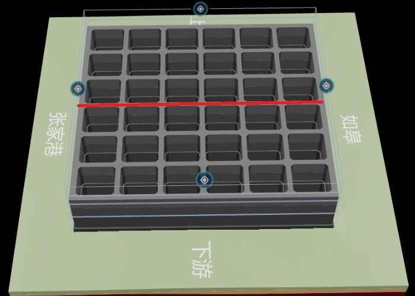
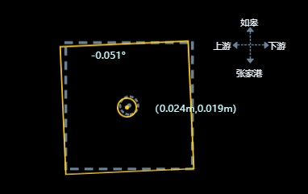
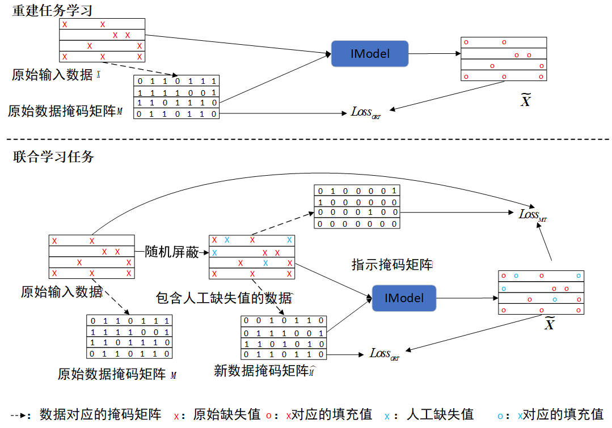
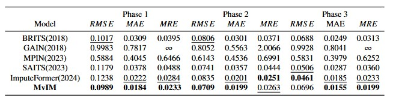

# Source code file directory description
* **datasets**: This directory contains three datasets for MvIM model validation.
* **logfiles**: This directory contains log files of the model training process.
* **model**: This directory contains the model structure.
* **pics**: Save the images used in the `README` file.
* **IModel.pt**: This file saves the trained model parameters.
* **TrainAndTest.ipynb**: This file performs model training and testing
# Background
Before predicting the open caisson attitude, the collected industrial data contains missing values, which need to be filled to improve data quality and thus improve the attitude prediction accuracy. Therefore, the MvIM missing values imputation model is proposed.
Open caisson attitude prediction includes two parts of data, sinking attitude indicators and bottom structure stress. This paper timestamps the two parts of data and uniformly fills the missing values. As shown in the horizontal position diagram of the open caisson, four sensors are arranged around the open caisson to collect the three-dimensional coordinates $x, y, z$ of the point respectively, and calculate the seven attitude indicators of the open caisson according to the setting of the open caisson specifications: 

* **Sinking depth**：The sinking depth of the center point of the top of the open caisson. For example, in the horizontal position diagram of the caisson, the three-dimensional coordinates of the center point of the open caisson are the average of the three-dimensional coordinates of the four sides. The sinking depth of the open caisson refers to the sinking height of $z$ within a period of time.。

* **Horizontal inclination**：The horizontal direction represents the upstream and downstream directions. When the open caisson is tilted toward the downstream, the horizontal inclination is positive. As shown in the horizontal position diagram of the open caisson, when the open caisson is tilted on the upstream and downstream axis, it is defined as the horizontal inclination.

* **Vertical inclination**：The vertical direction represents the direction of Rugao and Zhangjiagang. When the open caisson is tilted toward Zhangjiagang, the vertical inclination is positive. As shown in the vertical position diagram of the open caisson, when the open caisson is tilted on the axis of Zhangjiagang and Rugao, the vertical inclination is defined as.

* **Bottom deviation(Horizontal, vertical)**：The bottom opening deviation represents the horizontal and vertical deviation between the real-time position of the center point of the bottom opening of the open caisson and the preset center point position. As shown in the open caisson bottom opening position diagram, the white dotted line frame and its axis are the predefined center open position, the yellow solid line frame and its axis are the actual caisson position, and the horizontal and vertical deviations between the axes are the bottom opening deviation of the open caisson.

* **Top deviation(Horizontal, vertical)**：The top opening deviation refers to the horizontal and vertical deviation between the real-time position of the center point of the top opening of the open caisson and the preset center point position.

             
Horizontal position diagram of the open caisson
 

             
Vertical position diagram of the open caisson
 

             
Bottom deviation diagram of the open caisson
 

# MvIM
## Model architecture
A deep learning model is established based on the transformer model to extract the spatio-temporal features between the sinking attitude data and the structural stress of the open caisson, thereby filling the missing values ​​in the time series data. The model is mainly divided into an input embedding layer, a temporal multi-head mask attention layer, and a spatial embedding attention layer.

             
Architecture of MvIM
 

## Joint union learning for model training
Since the original time series contains missing values, MvIM takes the time series containing artificial missing values ​​as input and uses joint optimization learning for model training.Joint optimization learning consists of two tasks: the imputing task and the reconstruction task. Among them, the imputing mask forces the MvIM to impute missing values as accurately
as possible, and the reconstruction ensures that the MvIM converges to the data distribution of the observation value.

             
Training process of MvIM
 

# Parameters for baseline
## BRITS

* @article{cao2018brits,
    title={Brits: Bidirectional recurrent imputation for time series},
    author={Cao, Wei and Wang, Dong and Li, Jian and Zhou, Hao and Li, Lei and Li, Yitan},
    journal={Advances in neural information processing systems},
    volume={31},
    year={2018}
  }
* https://github.com/caow13/BRITS
* Paramenter setting: Number of hidden nodes: 108, Weight of imputation loss: 0.3, Weight of downstream loss: 0.0

## GAIN
* @inproceedings{yoon2018gain,
    title={Gain: Missing data imputation using generative adversarial nets},
    author={Yoon, Jinsung and Jordon, James and Schaar, Mihaela},
    booktitle={International conference on machine learning},
    pages={5689--5698},
    year={2018},
    organization={PMLR}
  }
* https://github.com/jsyoon0823/GAIN
* Parameter setting: Weight of mask matrix masking: 0.1, Weight of imputation loss: 0.3, Number of training iterations: 10000
## MPIN
* @article{li2023missing,
    title={Missing Value Imputation for Multi-attribute Sensor Data Streams via Message Propagation},
    author={Li, Xiao and Li, Huan and Lu, Hua and Jensen, Christian S and Pandey, Varun and Markl, Volker},
    journal={Proceedings of the VLDB Endowment},
    volume={17},
    number={3},
    pages={345--358},
    year={2023},
    publisher={VLDB Endowment}
  }
* https://github.com/XLI-2020/MPIN
* Parameter setting: Number of KNN neighbors: 10, Input dimension of multilayer perceptron: 256, learning rate: 0.001
## SAITS
* @article{du2023saits,
    title={Saits: Self-attention-based imputation for time series},
    author={Du, Wenjie and C{\^o}t{\'e}, David and Liu, Yan},
    journal={Expert Systems with Applications},
    volume={219},
    pages={119619},
    year={2023},
    publisher={Elsevier}
  }
* https://github.com/WenjieDu/SAITS
* Parameter setting: Dimension of data embedding: 256, Number of attention heads: 4, Dimension of key vector: 64, Dimension of feedforward connection layer: 128, Number of network layers: 2
## ImputeFormer
* @inproceedings{nie2024imputeformer,
    title={ImputeFormer: Low rankness-induced transformers for generalizable spatiotemporal imputation},
    author={Nie, Tong and Qin, Guoyang and Ma, Wei and Mei, Yuewen and Sun, Jian},
    booktitle={Proceedings of the 30th ACM SIGKDD Conference on Knowledge Discovery and Data Mining},
    pages={2260--2271},
    year={2024}
  }
* https://github.com/WenjieDu/SAITS
* Parameter setting: Dimension of data embedding: 24, Dimension of nodel embedding: 80, Dimension of learnable projection: 10, Number of attention heads 4, Dimension of feedforward connection layer: 128, Number of network layers: 2
# Experimental environment
* Server hardware configuration: operating system is Ubuntu 18.04.6 LTS, graphics card model is RTX A5000 GPU, CPU model is Intel Xeon Gold 6230R CPU。
* Software environment: python3.9, pytorch2.10GPU
# Experimental result
Each model in this paper fills missing values ​​in time series data and uses root mean square error RMSE, mean absolute error MAE, and mean relative error MRE as evaluation indicators. The interpolation results of each model are shown in the following table.

             
Imputation results of each model
 

